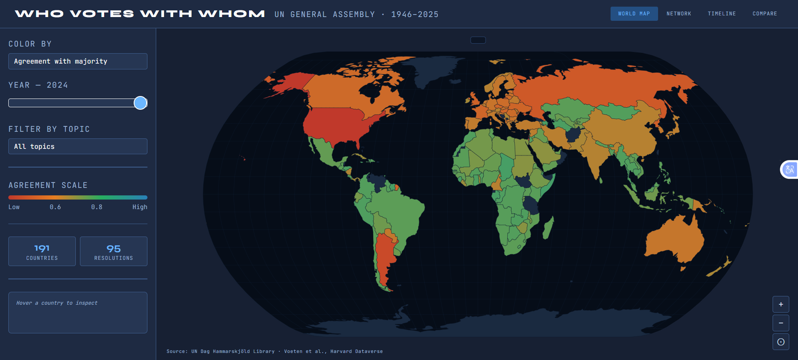
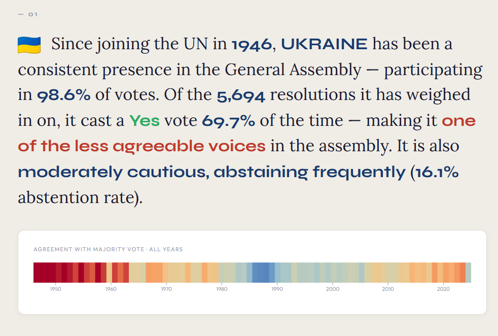

# Who Votes With Whom
**Geopolitical Alignment in the UN General Assembly**

Interactive visualization of UN General Assembly voting patterns, 1946–2025.

Group 68: Tanja Matura (01307001), Pekmezci Ece, Guryca Simon

---

## Setup

### Data

Download the following files and place them in the correct folders:

- **UN voting data** → `data/raw/2026_02_06_ga_voting.csv`  
  https://digitallibrary.un.org/record/4060887

- **Voeten ideal points** → `data/raw/dataverse_files/Idealpointestimates1946-2025.csv`  
  https://doi.org/10.7910/DVN/LEJUQZ

---

## Pipeline

### Inspect the data (optional)
```
python pipeline/loadFiles.py
```
Loads the raw data and prints basic statistics — no output files.

### Run the full pipeline (mandatory for the webview to work)
```
python pipeline/pipeline.py
```
Cleans the data, classifies subjects, joins with ideal points, computes pairwise agreement scores, and exports `data/processed/votes.db`, `data/processed/votes_clean.csv` and `un_with_idealpoints.csv`. 

Runtime is approximately 3–5 minutes.

---

## Running the Visualization

From the project root, start a local server:
```
python -m http.server 8000
```

Then open your browser and go to:
```
http://localhost:8000/viz/map.html
```

---

## Project Structure

```
project/
├── pipeline/
│   ├── loadFiles.py      — data inspection
│   ├── pipeline.py       — full pipeline
│   └── subject_map.py    — subject category mappings
├── viz/
│   ├── map.html          — main visualization
│   └── map.css           — styles
├── data/
│   ├── raw/              — raw source files 
│   └── processed/        — generated files 
├── .gitignore
└── README.md
```
---

## Pages

The project offers differet views to explore the data. The map view (/viz/map.html), which is the main page: 



A detail page for every country (viz/story.html?code=UKR), accesible via the navigation after selection a country: 


A story page (viz/story.html?code=UKR), which presents findings in a more engaging way: 



And a comparison view of two countries: 


---

## Data Sources

- UN Dag Hammarskjöld Library — *General Assembly Voting Data*, version 5, February 2026. [digitallibrary.un.org](https://digitallibrary.un.org/record/4060887)
- Voeten, Strezhnev, Bailey — *UN General Assembly Ideal Point Estimates*, Harvard Dataverse. [doi:10.7910/DVN/LEJUQZ](https://doi.org/10.7910/DVN/LEJUQZ)