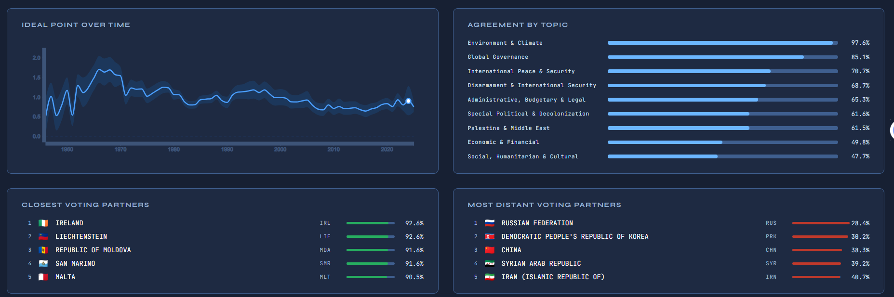
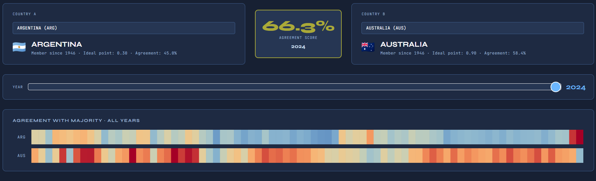

# Who Votes With Whom
**Geopolitical Alignment in the UN General Assembly**

Interactive visualization of UN General Assembly voting patterns, 1946–2025.

Group 68: Tanja Matura (01307001), Pekmezci Ece (12552155), Guryca Simon (12112607)

---

## Setup

### Data

Download the following files and place them in the correct folders:

- **UN voting data** → `data/raw/2026_02_06_ga_voting.csv`  
  https://digitallibrary.un.org/record/4060887

- **Voeten ideal points** → `data/raw/dataverse_files/Idealpointestimates1946-2025.csv`  
  https://doi.org/10.7910/DVN/LEJUQZ


**What are ideal points?** - The ideal point was developed by political scientists Michael Bailey, Anton Strezhnev, and Erik Voeten using a statistical method called Bayesian ideal point estimation. With over 198,000 downloads, it is a widely used datasets in international relations research. Its purpose is to show where a country lies on a single dimension of international political alignment, derived from its full UN General Assembly voting record. Higher values indicate closer alignment with Western liberal positions (support for human rights resolutions, democratic norms, and the US-led international order), while lower values reflect alignment with the Global South, sovereignty-first, or non-interventionist positions. For more information visit the link above.

---

## Pipeline

### Inspect the data (optional)
```
python pipeline/loadFiles.py
```
Loads the raw data and prints basic statistics — no output files.

### Run the full pipeline (mandatory for the webview to work)
```
python pipeline/pipeline.py
```
Cleans the data, classifies subjects, joins with ideal points, computes pairwise agreement scores, and exports `data/processed/votes.db` and `data/processed/un_clean.csv`.

Runtime is approximately 3–5 minutes.

---

**Alternatively you can download the generated files from here:"
https://tuwienacat-my.sharepoint.com/:f:/r/personal/e12552155_student_tuwien_ac_at/Documents/data?csf=1&web=1&e=Fz0m4S

## Running the Visualization

From the project root, start a local server:
```
python -m http.server 8000
```

Then open your browser and go to:
```
http://localhost:8000/viz/map.html
```

---

## Project Structure

```
project/
├── pipeline/
│   ├── loadFiles.py      — data inspection
│   ├── pipeline.py       — full pipeline
│   └── subject_map.py    — subject category mappings
├── viz/
│   ├── map.html          — world map visualization
│   ├── map.css           — map styles
│   ├── country.html      — country detail page
│   ├── country.css       — country detail styles
│   ├── story.html        — data story page
│   ├── story.css         — story styles
│   ├── compare.html      — country comparison page
│   ├── compare.css       — comparison styles
│   └── utils.js          — shared utilities (DB, helpers, constants)
├── img/                  — images for the README
├── data/
│   ├── raw/              — raw source files
│   └── processed/        — generated files (votes.db, un_clean.csv)
├── .gitignore
└── README.md
---

## Pages

The project offers differet views to explore the data. 

1. The **map view** (/viz/map.html), which is the main page: 


The map view initial shows the average agreement of a country with adopted UN resolutions. The user can hover countries to get more information. When clicking on a country the map updates to show how much other countries agree with the selected country. On the left the user has the option to additionally filter years. The color scheme can also be switched to a more color-blind friendly one by clicking on the eye next to "Agreement scale"

2. A **detail page** for every country (viz/story.html?code=UKR), accesible via the navigation after selection a country: 



The country detail page shows more in-depth data about the selected country, like their closest and most distand voting partners and can also be filtered by year. For transparency it also includes all resolutions at the bottom.

3. A **story page** (viz/story.html?code=UKR), which presents findings in a more engaging way: 


On the story page, accessible both over the world map and the country detail page, the user can scroll through a prepared presentation of the data, gaining insights that might be difficult to tell from the world map or raw details alone. Many elements are interactive, such as:
  - The dotplot in 02 which allows to enable and disable blocs by clicking in the navigation. It also has a second color-scheme to chose from.
  - In 02 hovering the cards reveals the top 5 countries
  - 03, 04 and 08 can dynamically display more data
  - Clicking a countries name will open the country`s story next to the current one, should the user quickly want to repair them
  - text is dynamic depending on the data

5. And a **comparison view** of two countries: 



Here the user can directly compare two counries, should they be interested in their relationship.

---

## Data Sources

- UN Dag Hammarskjöld Library — *General Assembly Voting Data*, version 5, February 2026. [digitallibrary.un.org](https://digitallibrary.un.org/record/4060887)
- Voeten, Strezhnev, Bailey — *UN General Assembly Ideal Point Estimates*, Harvard Dataverse. [doi:10.7910/DVN/LEJUQZ](https://doi.org/10.7910/DVN/LEJUQZ)